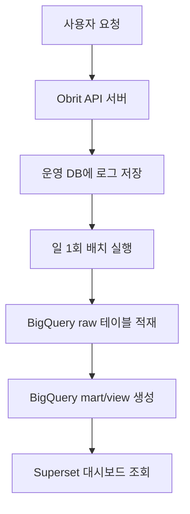

# Obrit 데이터 파이프라인 설계안

## 무엇을 만들었는지!

**Obrit 사용자 행동과 서버 상태를 한눈에 확인할 수 있는 데이터 분석 파이프라인**을 설계했습니다.

현재 서버에 쌓이는 로그를 운영 DB에만 두지 않고, 하루 1회 BigQuery로 적재한 다음 Superset 대시보드로 확인하는 구조입니다.

목적은 두 가지입니다.

- 제품팀은 사용자가 어떤 기능을 실제로 쓰는지 확인한다.
- 개발팀은 운영 DB에 부담을 주지 않고 API 품질과 에러를 확인한다.

## 현재 상태

레포에는 이미 로그를 저장하는 기반이 있습니다.

### 1. API 접근 로그

`api_access_logs` 테이블에는 모든 API 요청의 기본 정보가 저장됩니다.

| 컬럼 | 의미 |
| --- | --- |
| `user_id` | 요청한 사용자 ID |
| `method` | HTTP method |
| `path` | 실제 요청 경로 |
| `path_template` | 템플릿 경로 |
| `status_code` | 응답 상태코드 |
| `duration_ms` | 응답 시간 |
| `occurred_at` | 요청 발생 시각 |

이 로그로 API 요청 수, 에러율, 느린 API를 분석할 수 있습니다.

### 2. 비즈니스 이벤트 로그

`analytics_events` 테이블에는 제품적으로 의미 있는 행동이 저장됩니다.

| 컬럼 | 의미 |
| --- | --- |
| `event_id` | 이벤트 고유 ID |
| `event_name` | 이벤트 이름 |
| `user_id` | 이벤트를 발생시킨 사용자 |
| `occurred_at` | 이벤트 발생 시각 |
| `properties` | 이벤트별 추가 정보 JSON |

현재는 `signup_completed` 이벤트가 저장되고 있습니다.

## 문제

로그는 이미 DB에 쌓이고 있지만, 이 상태로는 분석용 대시보드를 운영하기 어렵습니다.

### 1. 로그가 빠르게 증가함

API 접근 로그는 모든 요청마다 저장됩니다.

사용자가 늘어나거나 분석 기간이 길어지면 로그 테이블 크기가 빠르게 커집니다.

### 2. 운영 DB에 분석 쿼리를 날리면 성능 부담이 생김

대시보드는 보통 기간별 집계, 사용자별 집계, API별 집계처럼 무거운 쿼리를 자주 실행합니다.

운영 DB에서 이런 쿼리를 직접 실행하면 실제 서비스 요청 처리 성능에 영향을 줄 수 있습니다.

### 3. Grafana만으로는 제품 행동 분석이 부족함

Prometheus와 Grafana는 서버 상태를 보는 데 좋습니다.

하지만 DAU, OCR 사용률, 아이템 등록 전환, 사용자별 행동 흐름 같은 제품 분석에는 BigQuery와 Superset이 더 적합합니다.

## 설계

### 원칙

운영 DB는 서비스 요청 처리에 집중하고, 분석 쿼리는 BigQuery에서 실행합니다.

### 1. 수집

서버는 기존 방식대로 운영 DB에 로그를 저장합니다.

- API 요청: `api_access_logs`
- 제품 이벤트: `analytics_events`

추가로 제품 분석을 위해 이벤트를 늘립니다.

| 이벤트 | 발생 시점 |
| --- | --- |
| `signup_completed` | 신규 사용자 가입 완료 |
| `home_viewed` | 홈 화면 진입 |
| `receipt_analyzed` | 영수증 OCR 분석 완료 |
| `item_created` | 단일 아이템 등록 |
| `bulk_item_created` | OCR 결과 등으로 아이템 일괄 등록 |
| `item_replaced` | 소모품 교체 기록 생성 |
| `category_created` | 사용자 카테고리 생성 |

### 2. 적재

하루 1회 배치로 전날 데이터를 BigQuery에 적재합니다.

초기 기준은 다음과 같습니다.

- 실행 주기: 하루 1회
- 적재 방식: `occurred_at` 기준 증분 적재
- 중복 방지: `id` 또는 `event_id` 기준 dedup
- 실패 대응: 같은 날짜 배치를 다시 실행해도 같은 결과가 나오도록 idempotent하게 구성

### 3. 저장

BigQuery에는 raw 테이블과 분석용 view/mart를 분리합니다.

| 구분 | 예시 | 용도 |
| --- | --- | --- |
| Raw | `raw_api_access_logs` | 운영 DB 로그를 그대로 보관 |
| Raw | `raw_analytics_events` | 이벤트 로그를 그대로 보관 |
| Mart | `daily_product_metrics` | DAU, 가입, OCR, 아이템 등록 지표 |
| Mart | `daily_api_metrics` | API 요청 수, 에러율, 응답시간 |

`occurred_at` 날짜 기준으로 파티션을 나누면 기간별 조회 비용을 줄일 수 있습니다.

### 4. 시각화

Superset은 BigQuery만 조회합니다.

운영 DB에는 Superset이 직접 접근하지 않습니다.

## 기능

### 1. 제품 핵심지표 대시보드

사용자가 실제로 제품을 어떻게 쓰는지 확인합니다.

| 지표 | 설명 |
| --- | --- |
| DAU | 하루 동안 API를 사용한 고유 사용자 수 |
| 신규 가입자 수 | `signup_completed` 발생 사용자 수 |
| OCR 사용률 | 가입자 또는 활성 사용자 중 OCR 사용 비율 |
| 아이템 등록 수 | 단일/일괄 아이템 등록 수 |
| 교체 기록 수 | 소모품 교체 행동 발생 수 |
| 카테고리 생성 수 | 사용자 커스텀 카테고리 생성 수 |

이 대시보드로 볼 수 있는 질문:

- 사용자가 가입 후 실제로 아이템을 등록하는가?
- OCR 기능이 얼마나 사용되는가?
- OCR 분석 이후 일괄 등록까지 이어지는가?
- 소모품 교체 기록이 실제 관리 행동으로 이어지는가?

### 2. 기술 운영지표 대시보드

API 품질과 서버 상태를 로그 기반으로 확인합니다.

| 지표 | 설명 |
| --- | --- |
| API 요청 수 | 날짜/시간/API별 요청량 |
| 상태코드 비율 | 2xx, 4xx, 5xx 비율 |
| 에러율 | API별 실패 비율 |
| 평균 응답시간 | API별 평균 latency |
| 느린 API Top N | 응답시간이 긴 API 목록 |
| 사용자별 요청량 | 특정 사용자의 과도한 요청 여부 |

이 대시보드로 볼 수 있는 질문:

- 어떤 API에서 에러가 많이 나는가?
- 특정 시간대에 요청이 몰리는가?
- OCR, 아이템 등록 같은 핵심 API가 느려지는가?
- 서비스 장애 전에 5xx나 latency가 증가하는가?

## 결과

이 구조를 적용하면 운영 DB와 분석 워크로드를 분리할 수 있습니다.

기존에는 로그가 운영 DB에만 있었기 때문에 분석 쿼리도 운영 DB를 직접 조회해야 했습니다.

변경 후에는 Superset이 BigQuery만 조회하므로, 대시보드를 자주 열어도 서비스 DB 부하가 증가하지 않습니다.

또한 제품 지표와 기술 운영지표를 같은 파이프라인에서 볼 수 있습니다.

### 기대효과

- 운영 DB 분석 쿼리 부담 감소
- 로그 증가에 대한 확장성 확보
- Superset을 통한 비개발자용 대시보드 제공
- DAU, OCR 사용률, 아이템 등록 수 같은 제품 지표 확인
- API 에러율, 응답시간, 느린 API 같은 운영 지표 확인

## 개선점

현재 설계는 하루 1회 배치이므로 실시간 분석에는 적합하지 않습니다.

하지만 초기 단계에서는 구현 난이도와 비용을 낮추는 것이 더 중요합니다.

운영 후 필요성이 확인되면 다음 단계로 확장할 수 있습니다.

- 1일 1회 배치 -> 1시간 단위 배치
- Batch ETL -> CDC 기반 실시간 적재
- Raw 로그 조회 -> 제품별 mart 테이블 고도화
- Superset 단일 대시보드 -> 제품/운영/마케팅 대시보드 분리

## 검증 기준

### 데이터 적재 검증

- 하루치 `api_access_logs`가 BigQuery에 누락 없이 적재된다.
- 하루치 `analytics_events`가 BigQuery에 누락 없이 적재된다.
- 같은 날짜 배치를 재실행해도 중복 row가 생기지 않는다.
- 운영 DB와 BigQuery의 날짜별 row count가 일치한다.

### 대시보드 검증

- Superset에서 날짜 필터가 동작한다.
- Superset에서 API 경로별 필터가 동작한다.
- Superset에서 이벤트명 필터가 동작한다.
- 제품 핵심지표와 기술 운영지표가 각각 확인된다.

### 운영 검증

- Superset은 운영 DB가 아니라 BigQuery를 조회한다.
- 배치 실패 시 실패 날짜를 기준으로 재실행할 수 있다.
- 배치 실행 중에도 API 서버 요청 처리에 영향이 없다.

## 정리

Obrit의 데이터 파이프라인은 처음부터 복잡한 실시간 구조로 가지 않고, 현재 레포에 이미 있는 로그 테이블을 활용합니다.

1일 1회 배치로 BigQuery에 적재하고, Superset에서 제품 핵심지표와 기술 운영지표를 확인하는 구조로 시작합니다.

이렇게 하면 운영 DB 부하를 줄이면서도, 사용자의 실제 행동과 API 품질을 함께 분석할 수 있습니다.
