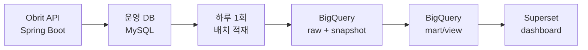

# Obrit 데이터 파이프라인 테크 스펙

## 요약

Obrit 운영 DB(MySQL)에 저장되는 로그 테이블과 핵심 도메인 테이블을 하루 1회 BigQuery로 적재하고,
Superset에서 제품 지표와 기술 운영지표를 조회한다.

핵심 방향은 다음과 같다.

- 운영 DB는 서비스 요청 처리에 집중한다.
- BigQuery는 분석 쿼리 전용 저장소로 사용한다.
- Superset은 운영 DB를 직접 조회하지 않고 BigQuery의 mart/view만 조회한다.
- 로그만 적재하지 않고, 사용자/아이템/카테고리 같은 핵심 도메인 테이블도 함께 적재한다.

## 목적

### 운영 DB 부하 분리

대시보드 쿼리는 기간별 집계, 사용자별 집계, API별 집계처럼 무거운 조회가 많다.
이를 운영 DB에서 직접 실행하지 않고 BigQuery에서 처리해 서비스 DB 부하를 줄인다.

### 제품 지표 분석

사용자가 가입 이후 어떤 행동을 하는지 확인한다.

- 가입자 수
- DAU
- OCR 사용률
- 아이템 등록 수
- 카테고리 생성 수
- 소모품 교체 기록 수

### 기술 운영지표 분석

API 품질을 로그 기반으로 확인한다.

- API 요청 수
- 상태코드 비율
- 4xx/5xx 에러율
- API별 평균 응답시간
- 느린 API Top N

### 도메인 맥락을 포함한 분석

로그만으로는 "어떤 행동이 발생했다"는 사실만 알 수 있다.
도메인 테이블을 함께 적재하면 행동의 맥락을 조인해서 볼 수 있다.

예시:

- OCR을 사용한 사용자가 실제로 아이템을 등록했는가?
- 어떤 카테고리의 소모품이 많이 등록되는가?
- 교체 기록이 많은 사용자는 어떤 아이템을 관리하는가?
- API 에러가 특정 기능 사용 흐름에 영향을 주는가?

## 목적이 아닌 것

### 실시간 CDC 구축

초기 범위는 하루 1회 배치 적재다.
Debezium, Kafka, Pub/Sub 같은 CDC 기반 실시간 적재는 이번 범위가 아니다.

### Grafana 대체

Prometheus와 Grafana는 서버 상태 모니터링 용도로 유지한다.
Superset은 제품 행동 분석과 로그 기반 집계 분석에 사용한다.

### 운영 DB 직접 조회 대시보드

Superset이 운영 DB에 직접 붙는 구조는 만들지 않는다.
모든 Superset 쿼리는 BigQuery를 대상으로 실행한다.

### 전체 데이터 거버넌스 완성

권한 체계, 데이터 카탈로그, 장기 보관 정책, 개인정보 파기 자동화까지 완성하는 것은 이번 범위가 아니다.
다만 민감 컬럼 처리 기준은 확인 항목으로 남긴다.

### 모든 테이블의 무조건 적재

운영 DB의 모든 시스템 테이블이나 임시 테이블을 적재하지 않는다.
초기에는 현재 레포 migration에 정의된 핵심 비즈니스 테이블만 적재한다.

## 계획

### 1. 적재 대상

#### 로그 테이블

| 테이블 | 목적 | 적재 방식 |
| --- | --- | --- |
| `api_access_logs` | API 요청량, 에러율, 응답시간 분석 | append-only 증분 적재 |
| `analytics_events` | 제품 행동 이벤트 분석 | append-only 증분 적재 |

#### 핵심 도메인 테이블

| 테이블 | 목적 | 적재 방식 |
| --- | --- | --- |
| `users` | 가입자, 활성 사용자 기준 집계 | 일 단위 스냅샷 |
| `icons` | 카테고리 아이콘 참조 정보 | 일 단위 스냅샷 |
| `categories` | 카테고리별 등록/사용 패턴 분석 | 일 단위 스냅샷 |
| `items` | 아이템 등록, 보유, 삭제 상태 분석 | 일 단위 스냅샷 |
| `item_replacement_histories` | 실제 소모품 교체 행동 분석 | 일 단위 스냅샷 |

### 2. 적재 방식

#### 로그/이벤트 테이블

`api_access_logs`와 `analytics_events`는 발생 시각 기준으로 계속 쌓이는 데이터다.
따라서 `occurred_at` 기준으로 전날 데이터를 append-only 증분 적재한다.

중복 방지 기준:

- `api_access_logs`: `id`
- `analytics_events`: `event_id`

#### 도메인 테이블

`users`, `icons`, `categories`, `items`, `item_replacement_histories`는 현재 상태를 분석에 사용한다.
하루 1회 전체 스냅샷을 BigQuery에 저장하고, `snapshot_date` 컬럼으로 기준일을 구분한다.

스냅샷을 사용하는 이유:

- soft delete 상태(`deleted_at`)까지 날짜별로 추적할 수 있다.
- 특정 날짜의 사용자/아이템/카테고리 상태를 재현할 수 있다.
- 운영 DB의 update/delete 이력을 별도 CDC 없이 분석할 수 있다.

### 3. BigQuery 테이블 구조

BigQuery는 raw/snapshot 계층과 mart/view 계층을 분리한다.

| 계층 | 예시 | 설명 |
| --- | --- | --- |
| Raw | `raw_api_access_logs` | 운영 DB 로그를 거의 그대로 적재 |
| Raw | `raw_analytics_events` | 이벤트 로그를 거의 그대로 적재 |
| Snapshot | `snap_users` | 일자별 사용자 테이블 스냅샷 |
| Snapshot | `snap_items` | 일자별 아이템 테이블 스냅샷 |
| Mart/View | `daily_product_metrics` | Superset 제품 지표 조회용 |
| Mart/View | `daily_api_metrics` | Superset 운영지표 조회용 |

파티션 기준:

- 로그 테이블: `DATE(occurred_at)`
- 스냅샷 테이블: `snapshot_date`
- mart/view: 지표 기준일

### 4. Superset 대시보드

Superset은 BigQuery의 mart/view를 조회한다.

초기 대시보드는 두 개로 나눈다.

#### 제품 핵심지표

- DAU
- 신규 가입자 수
- OCR 사용률
- 아이템 등록 수
- 카테고리 생성 수
- 소모품 교체 기록 수
- 카테고리별 아이템 등록 분포

#### 기술 운영지표

- API 요청 수
- API별 4xx/5xx 비율
- API별 평균 응답시간
- 느린 API Top N
- 시간대별 요청량
- 사용자별 요청량 분포

### 5. 검증 방식

#### 적재 검증

- 전날 `api_access_logs` row count와 BigQuery 적재 row count가 일치한다.
- 전날 `analytics_events` row count와 BigQuery 적재 row count가 일치한다.
- 같은 날짜 배치를 재실행해도 로그/이벤트 row가 중복되지 않는다.
- 스냅샷 테이블에 `snapshot_date` 기준 데이터가 생성된다.

#### 대시보드 검증

- Superset 날짜 필터가 동작한다.
- Superset API 경로 필터가 동작한다.
- Superset 이벤트명 필터가 동작한다.
- Superset이 운영 DB가 아니라 BigQuery를 조회한다.

#### 운영 검증

- 배치 실패 시 실패 날짜를 기준으로 재실행할 수 있다.
- 배치 실행 중 API 서버 요청 처리가 막히지 않는다.
- 배치 결과가 없을 때 대시보드에서 빈 값이 명확히 보인다.

## 확인이 필요한 점

### 민감 컬럼 처리

다음 값을 BigQuery raw/snapshot에 그대로 둘지, 마스킹할지 결정해야 한다.

- `users.uuid`
- `items.receipt_image_url`
- `icons.url`
- `analytics_events.properties`

초기 기본값은 다음과 같이 둔다.

- raw/snapshot 테이블은 제한된 계정만 접근한다.
- Superset은 마스킹되거나 집계된 mart/view만 조회한다.
- 사용자 식별은 내부 `user_id` 기준으로 하고, 외부 식별자인 `uuid` 노출은 최소화한다.

### 배치 실행 위치

하루 1회 배치를 어디서 실행할지 결정해야 한다.

후보:

- GitHub Actions scheduled workflow
- 운영 서버 cron
- 별도 배치 컨테이너
- GCP Cloud Scheduler + Cloud Run

초기에는 운영 서버와 분리하기 쉬운 별도 배치 컨테이너 또는 Cloud Run 계열이 적합하다.

### BigQuery 프로젝트와 데이터셋

다음을 정해야 한다.

- GCP project id
- BigQuery dataset 이름
- raw/snapshot/mart 테이블 naming convention
- partition expiration 여부

### Superset 접근 권한

다음을 정해야 한다.

- 누가 제품 지표 대시보드를 볼 수 있는가?
- 누가 기술 운영지표 대시보드를 볼 수 있는가?
- raw/snapshot 테이블을 직접 조회할 수 있는 사람은 누구인가?

### 적재 실패 알림

배치 실패 시 알림 채널을 정해야 한다.

후보:

- Discord
- Slack-compatible webhook
- GitHub Actions failure notification
- Cloud Logging alert

### 비용 기준

BigQuery는 저장 비용보다 쿼리 비용이 문제가 될 수 있다.
Superset 대시보드가 raw 테이블을 직접 스캔하지 않도록 mart/view 중심으로 구성해야 한다.
